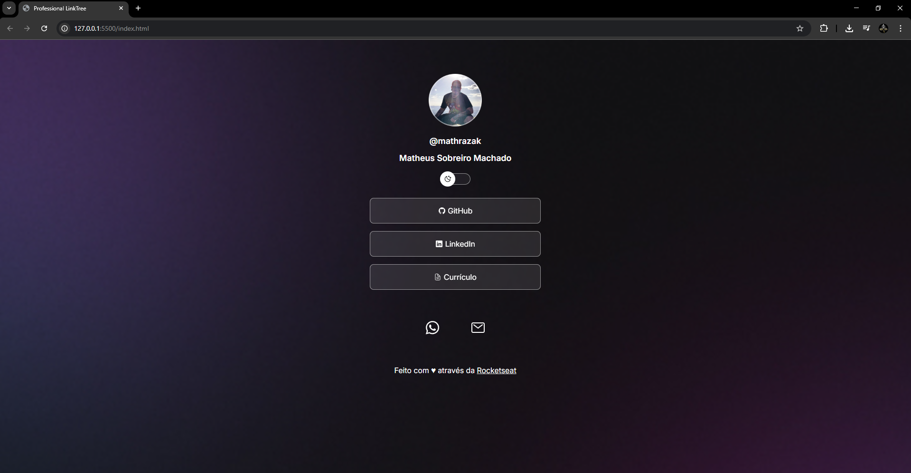

<h1 align="center"> Professional LinkTree </h1>

Project developed and promoted through Rocketseat free program to WEB tecnology teaching.  
<a href="https://lp.rocketseat.com.br/devlinks/inscricao?utm_source=github&utm_medium=descricao&utm_campaign=capture-devlinks&utm_term=organic&utm_content=descricao-github-mayk-brito">Study this project on video here.</a>

  <a href="#-tecnologias">Technologies</a>&nbsp;&nbsp;&nbsp;|&nbsp;&nbsp;&nbsp;
  <a href="#-projeto">Project</a>&nbsp;&nbsp;&nbsp;|&nbsp;&nbsp;&nbsp;
  <a href="#-layout">Layout</a>&nbsp;&nbsp;&nbsp;|&nbsp;&nbsp;&nbsp;
  <a href="#memo-licença">License</a>

  

 

  

## 🚀 Technologies

This project was developed using the following technologies:

- HTML e CSS
- JavaScript
- Git e Github
- Figma

## 💻 Project

This project was developed using Rocketseat teaching on a free course.

- [See the online course here](https://app.rocketseat.com.br/jornada/discover/visao-geral)

- [Rocketseat](https://www.rocketseat.com.br/)

## 🔖 Layout

You can see project's layout [here](https://www.figma.com/community/file/1187422022288947321). An existing account on [Figma](https://figma.com) is necessary.

## :memo: License

This project is under MIT license.

---

Made with ♥ through Rocketseat :wave: [Join the community!](https://discord.gg/rocketseat)
